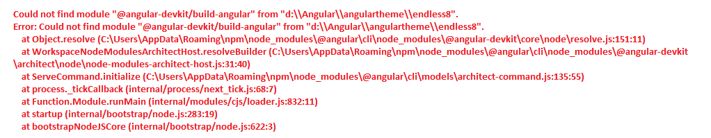
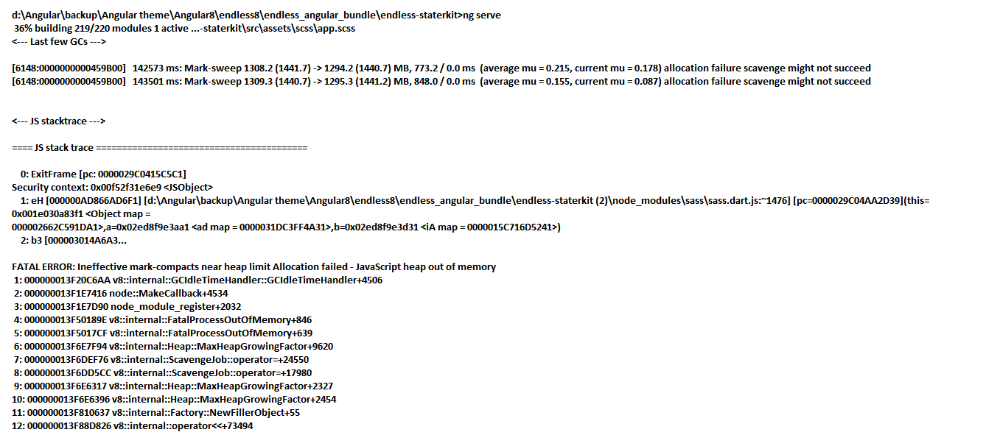
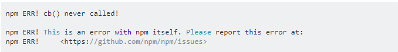
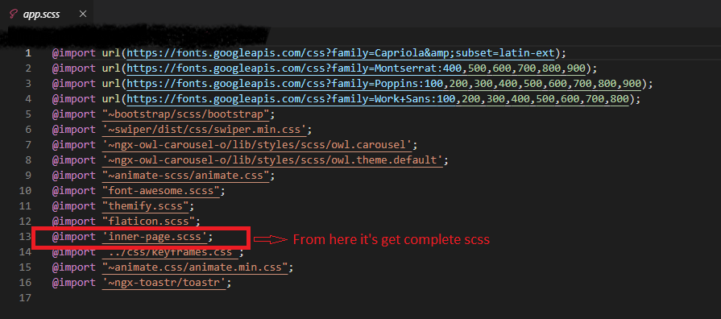

# EMAC

École militaire des aspirants de Coëtquidan.
Première version du site de l'EMAC. 

Ce site permet l'affichage d'informations concernant :
- l'EMAC
- les promotions de l'EMAC

## Contribuer

Afin de contribuer :
1. Créer une branche à partir de `main`.
2. Effectuer les modifications sur la nouvelle branche.
3. Créer une PR (pull request) de votre branche sur `main`.
4. Une fois la PR `review` et `merged`, la nouvelle version est déployée automatiquement sur le serveur de production.

## Organisation

- Les images se trouvent dans : `emac/public/assets/images`
- Les modèles de données se trouvent dans : `emac/src/app/shared/models`.
- Les données (type base de données format `JSON`) se trouvent dans : `emac/src/app/shared/data`.

Par exemple, afin d'ajouter une promotion, il suffit de modifier le fichier `emac/src/app/shared/data/promotion/promotion-list.ts` et d'y ajouter les informations de la nouvelle promotion (en ayant préalablement ajouté l'image dans le dossier mentionné plus haut) :
```ts
import { Promotion } from "../../models/promotion.interface";

export class PromotionListDB {
  static readonly list: Promotion[] = [
    // ...  
    {
      id: "col-bourgoin",
      title: "Colonel BOURGOIN",
      number: 6,
      logo: "assets/images/promotion/col-bourgoin.png",
      startDate: new Date(2025, 1, 1),
      endDate: new Date(2026, 1, 1),
    },
    {
        id: "new-promotion",
        title: "New Promotion",
        number: 7,
        logo: "link/to/the/image",
        startDate: new Date(2026, 1, 1),
        endDate: new Date(2027, 1, 1),
    },
  ];
}
```

# Developer guide

This project was generated using [Angular CLI](https://github.com/angular/angular-cli) version 20.2.1.

## Development server

To start a local development server, run:

```bash
ng serve
```

Once the server is running, open your browser and navigate to `http://localhost:4200/`. The application will automatically reload whenever you modify any of the source files.

## Code scaffolding

Angular CLI includes powerful code scaffolding tools. To generate a new component, run:

```bash
ng generate component component-name
```

For a complete list of available schematics (such as `components`, `directives`, or `pipes`), run:

```bash
ng generate --help
```

## Building

To build the project run:

```bash
ng build
```

This will compile your project and store the build artifacts in the `dist/` directory. By default, the production build optimizes your application for performance and speed.

## Running unit tests

To execute unit tests with the [Karma](https://karma-runner.github.io) test runner, use the following command:

```bash
ng test
```

## Running end-to-end tests

For end-to-end (e2e) testing, run:

```bash
ng e2e
```

Angular CLI does not come with an end-to-end testing framework by default. You can choose one that suits your needs.

## Additional Resources

For more information on using the Angular CLI, including detailed command references, visit the [Angular CLI Overview and Command Reference](https://angular.dev/tools/cli) page.

## Deploy

```bash
npm run github-build
npm run github-deploy
```

# Documentation

- SEO friendly structure and Without Jquery. The code written is a clean and well structured.
- Powerful & responsive theme with all the modules and functions involved with an attractive design.
- **Angular 20, ngbootstrap, HTML5, CSS3, scss and many more..**

### Getting started

Welcome to Angular! Angular helps you build modern applications for the web, mobile, or desktop.

For getting started an Angular application you needs two things as Prerequisites.

##### Prerequisites

Before you begin, make sure your development environment includes **Node** and an **npm package manager.**

##### Node.js

Download latest stable version of node.js i.e. 20.19.0 from [**nodejs.org.**](http://nodejs.org)

*   Install Node.js using downloaded file
*   To check your node version, run **node -v** in a terminal/console window.

##### Npm package manager

Angular CLI, and Angular apps depend on features and functionality provided by libraries that are available as npm packages. To download and install npm packages, you must have an npm package manager. This Quick Start uses the npm client command line interface, which is installed with Node.js by default. To check that you have the npm client installed, run **npm -v** in a terminal/console window.

For better understanding angular we suggest you to once go through official documentation of an Angular from [**angular.dev**](https://angular.dev/)

### Angular setup

##### Installing Angular CLI

You use the Angular CLI to create projects, generate application and library code, and perform a variety of ongoing development tasks such as testing, bundling, and deployment.

Install the Angular CLI globally.

To install the CLI using npm, open a terminal/console window and enter the following command:

```npm install -g @angular/cli```

### EMAC setup

If you have already download and install node.js and Angular CLI then ignore prerequisites accordingly.

##### Prerequisites

###### Node.js

Download stable version of node.js from [**nodejs.org.**](http://nodejs.org)

*   Install Node.js using downloaded file
*   To check your node version, run **node -v** in a terminal/console window.

###### Angular CLI

Install Angular CLI Using:

```npm install -g @angular/cli```

##### Setup EMAC project by

*   **1) Clone EMAC project from GitHub**
*   **2) Import all dependency by installing npm command**
```npm install```
*   **3) Now you are in stage to successfully run EMAC using below command:**
```ng serve```

### Common issue

##### A common issue which user face during setup

*   **1) If you had not doing "npm i" command for installing all dependencies and directly run "ng serve" command you may have following error**



**Solution:**

```npm install```

*   **2) when running command using "ng serve" you may get sass error as below:**



**Solution:**

```npm install node-sass --save-dev``` 

*   **2) Some times you also may get below error when running "ng serve"**



**Solution:**

```sudo npm cache clean```

### Folder Structured

Here we represent Angular Folder Structure and Style Customize

*   EMAC

    *   public
        *   assets
            *   css
            *   fonts
            *   images
            *   pace
            *   scss
            *   .gitkeep
        *   CNAME
        *   sitemap.xml

    *   src
        *   app
            *   emac
            *   maintenance
            *   page-not-found
            *   promotions
            *   shared
            *   app.html
            *   app.scss
            *   app.ts
            *   app.config.ts
            *   app.routes.ts
        *   index.html
        *   main.ts
        *   style.scss
    *   angular.json
    *   package.json
    *   tsconfig.json

### SCSS and CSS Structure

We have build complete theme in scss so as end user select particular layout they have to change in below file:



Now as per our needed layout we are dynamically add that particular css

### Customization

#### Menu

Horizontal Menu

You can get horizontal menu from shared -> components -> navigation -> menu. export that components from shared module and use it using selector where you want to use that horizontal menu.

Center Logo menu

You can also get center menu from shared -> components -> navigation -> center-menu. export that components from shared module and use it using selector where you want to use that center logo menu.

For Mobile Responsive it emable using toggle bar in responsive screen

### Dark & RTL

#### Unice Angular come with two new features

*   Dark

    If you want to use dark then you just need to add **<body class="dark">** in index.html at src root.
*   RTL

    If you want to use RTL then you just need to add **<body class="rtl">** in index.html at src root.

*   ##### **Main Theme**

    We have make one config file in main theme called **shared >> data >> config.ts** from where you can pass your default conflict like you want LTR or RTL and Dark or Light layout.
    
    Also, all text is defined in this file.
    
    That you can set from that config.ts

### Dependencies

*   **Bootstrap** : Doc: https://ng-bootstrap.github.io/#/home
*   **Ngx-toastr** : Doc: https://www.npmjs.com/package/ngx-toastr
*   **Gallery** : Doc: https://www.npmjs.com/package/@ks89/angular-modal-gallery
*   **Masonary Gallery** : Doc: https://www.npmjs.com/package/ngx-masonry
*   **Ngx-rangeslider** : Doc: https://www.npmjs.com/package/ngx-rangeslider-component
*   **Carousel** : Doc: https://www.npmjs.com/package/ngx-owl-carousel-o

### Thank you

Once again thank you for contribute of the EMAC project
-------------------------------------------------------

##### Best Regards, LucianoBrd